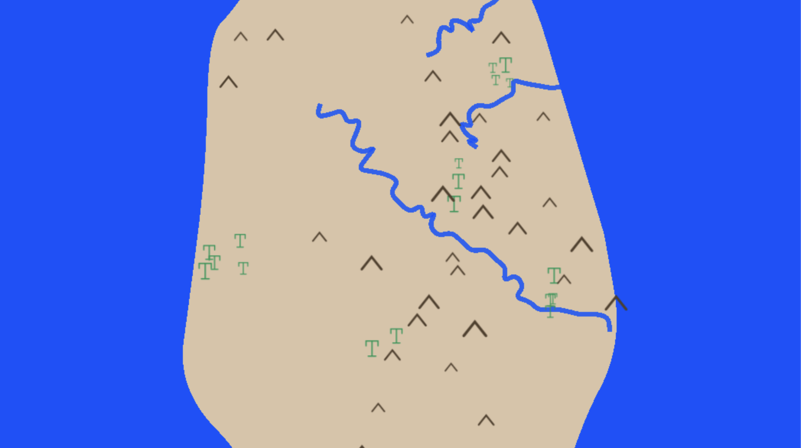

# Weird Island Generator



A procedural island generator built with PixiJS and TypeScript. Every time you run it, a unique island is generated complete with irregular coastlines, mountain ranges, winding rivers, and organically grown forests.

Try it out on [GitHub Pages!](https://greghcarr.github.io/weird-island-generator-pixijs/)

## Overview

Weird Island Generator creates a randomized top-down island map using a collection of procedural generation techniques. No two islands are the same — the landmass shape, the placement of mountain ranges, the paths of rivers, and the spread of forests are all determined at runtime using seeded randomness and simulation.

The project was built as an exploration of procedural generation concepts using PixiJS as the rendering engine.

### Features

- **Irregular landmass** — the island coastline is generated using randomized bezier curves, producing a natural, uneven shape
- **Mountain ranges** — mountains are chained together in a random direction with angular wobble, mimicking the appearance of real tectonic ridgelines
- **Rivers** — rivers start inland and flow outward toward the coast, meandering naturally before terminating at the shoreline
- **Forests** — trees are placed using a seed dispersal simulation across multiple generations, producing organic, irregularly shaped forests that respect the island boundary
- **Responsive scaling** — the world scales and centers itself to fit any screen size

## Installation & Setup

You will need [Node.js](https://nodejs.org/) installed.

1. Clone the repository:
   ```bash
   git clone https://github.com/greghcarr/weird-island-generator-pixijs.git
   cd weird-island-generator-pixijs
   ```

2. Install dependencies:
   ```bash
   npm install
   ```

3. Start the development server:
   ```bash
   npm run dev
   ```

4. Open your browser and navigate to `http://localhost:8080` (or whichever port your dev server uses).

To generate a new island, click the "Create!" button.

## How It Works

### Landmass Generation

The island shape is created by placing a set of points around an ellipse at randomized radii, then connecting them with quadratic bezier curves to produce smooth, organic edges. The result is a coastline that looks irregular and natural rather than perfectly round.

### Mountain Ranges

Each mountain range starts from a random point on the landmass and grows by chaining new mountains in a consistent direction with slight angular variation at each step. This produces the elongated, ridge-like appearance of real mountain ranges. Mountains that would fall outside the landmass boundary are discarded.

### Rivers

Rivers begin at a random inland point and flow outward by calculating the angle away from the landmass center at each step, with added random wobble to create meandering. The river terminates as soon as it reaches the coastline, ensuring it always ends cleanly at the shore.

### Forests

Forest generation uses a multi-generation seed dispersal simulation. A handful of founding trees are placed near the forest origin, and each generation every existing tree drops several seeds. Each seed has a survival probability that decreases with distance from the forest center, naturally producing dense cores that thin out toward the edges. Only seeds that land within the landmass boundary are allowed to grow.